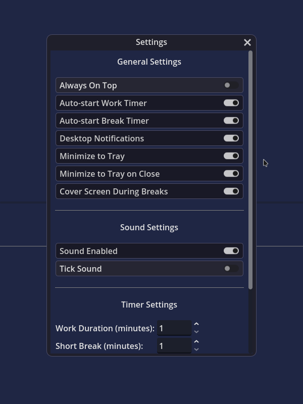
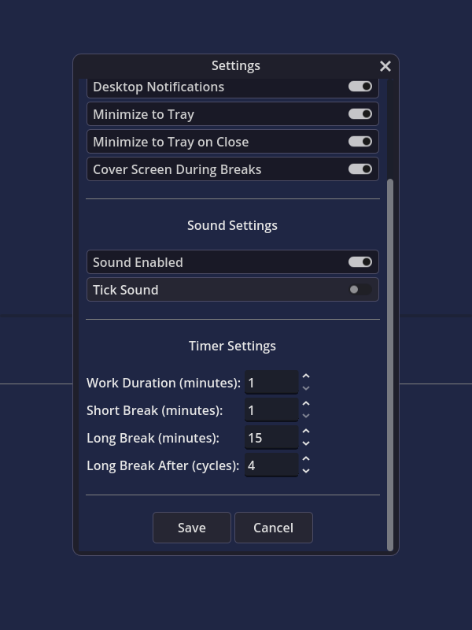
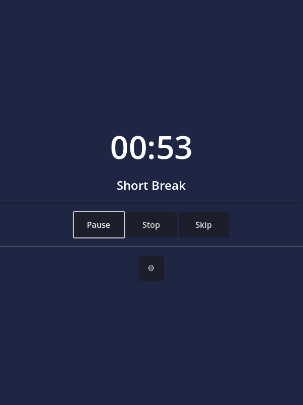

# Pomodorot - Godot Pomodoro Timer

A simple, customizable Pomodoro timer application built with Godot. Helps you follow the 20-20-20 rule (look away every 20 minutes for 20 seconds).

> Initially I had made it for getting up every 20 mins (to follow the 20 min rule of looking away for 20 secs and even maintaining proper blood circ.)

Or download the latest APK from the [Releases Section](https://github.com/mlm-games/pomodorot/releases/latest).

## Screenshots

  
  
  

## Features

- Pomodoro technique timing with work sessions and breaks
- Customizable durations for work, short breaks, and long breaks
- Command line options for automation
- Desktop notifications
- Sound alerts
- Minimization to system tray (Only for windows and macOS, linux users can use RBTray or similar)
- Always-on-top option
- Auto-start timers
- Cross-platform (Windows, Linux, macOS, Android)

## Command Line Options

The application supports the following command line options:

- `--start-timer`: Automatically starts the work timer when the application launches
- `--no-popups-and-sound`: Runs in silent mode (no sounds or notifications)
- `--silent`: Minimizes the window on launch

## Initial Settings

### General Settings
- **Always On Top**: Keeps the application window above other windows
- **Auto-start Work Timer**: Automatically starts the work timer after a break ends
- **Auto-start Break Timer**: Automatically starts a break timer after work ends
- **Desktop Notifications**: Shows desktop notifications when timers end
- **Minimize to Tray**: Allows the application to be minimized to the system tray
- **Minimize to Tray on Close**: Minimizes to tray instead of closing when the close button is clicked

### Sound Settings
- **Sound Enabled**: Enables or disables all sounds
- **Tick Sound**: Enables or disables the ticking sound during timers

### Timer Settings
- **Work Duration**: The length of work sessions in minutes
- **Short Break**: The length of short breaks in minutes
- **Long Break**: The length of long breaks in minutes
- **Long Break After**: Number of work cycles before a long break

## Opening the project from Source

1. Clone this repository
2. Open it in Godot and thats it;

## Version Trackers

| Platform    | Version |
|-------------|---------|
| F-Droid     |  |
| Chocolatey  |  |
| WinGet      |  |
| AUR         |  |

## License

GPL-3.0 [License](LICENSE.md)

## Credits

Heavily based on pomodorolm (but wanted another one for a command-line option for the timer to automatically start, for autostarting when the system boots up...)
